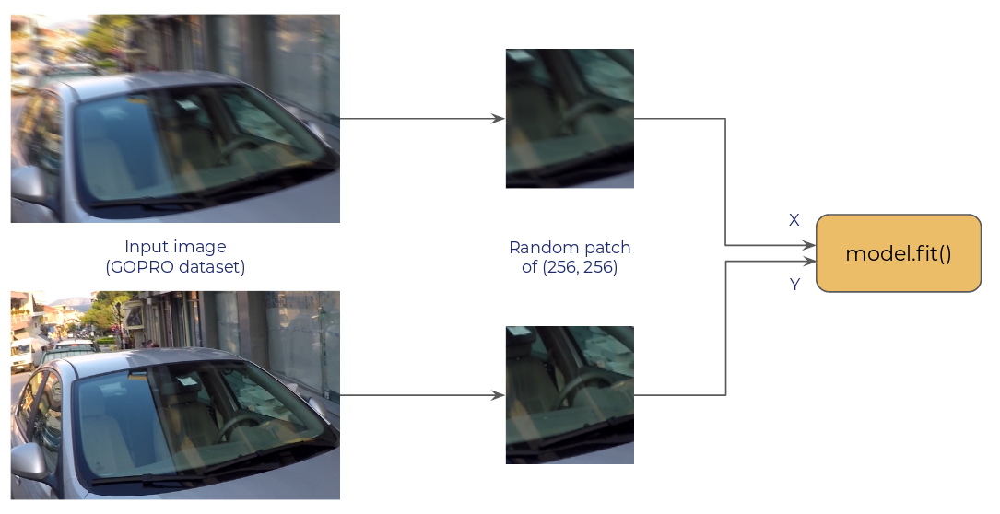

# TF2.0 Datasets Performance

This repo compares different data loading methods for TensorFlow
(tf.data, Keras Sequence, pure Python generator) and provides a
performance benchmark.

This is still ongoing work. If you spot an error or a possible
improvement, open an issue.

## Task

The objective is a deblurring task, where we have to pass two random
crops of a given input image to the model for training.

Training time is monitored on a RTX 2080 (Cuda 10.0,
tensorflow-gpu==2.0.0) for:

- num_epochs: 5
- steps_per_epoch: 200
- batch_size: 4
- patch_size: (256, 256)

Dataset used for this is the GOPRO Dataset (download it
[here](https://drive.google.com/file/d/1H0PIXvJH4c40pk7ou6nAwoxuR4Qh_Sa2/view)).

## Results

Results for the different loaders. Explanation on differences between
each loader is explained below.

| Loaders | Eager Mode (s) | Graph Mode (s) |
| ------- | ----------- | ----------- |
| `BasicPythonGenerator` | 410 | 71 |
| `BasicTFDataLoader` | 184 | 47|
| `TFDataNumParallelCalls` | 110 | 46 |
| `TFDataPrefetch` | 106 | 46 |
| `TFDataGroupedMap` | 103 | 46 |
| `TFDataCache` | 95 | 46 |

## Loaders

- [`BasicPythonGenerator`](./loaders/basic_python_generator_with_tf_operators.py):
  - Implement a simple `yield`
  - Operations to load images are using `tf.io` and `tf.image`
- [`BasicTFDataLoader`](./loaders/basic_tf_data_loader.py):
  - Use the `tf.data` API
  - Perform operations with `tf.io` and `tf.image`
- [`TFDataNumParallelCalls`](./loaders/num_parallel_calls_data_loader.py):
  - Add `num_parallel_calls=tf.data.experimental.AUTOTUNE` to each `.map` operations
- [`TFDataPrefetch`](./loaders/prefetch_data_loader.py):
  - Use prefetching to dataset with `dataset = dataset.prefetch(tf.data.experimental.AUTOTUNE)`
- [`TFDataGroupedMap`](./loaders/independant_data_loader_grouped_image_loading.py):
  - Group all `tf.io` and `tf.image` operations to avoid popping too much processes
- [`TFDataCache`](./loaders/independant_data_loader_cache.py):
  - Cache dataset before selecting random crops with `dataset.cache()`

## Advices

- Check for GPU drop with `nvidia-smi` and TensorBoard profiling
- Add `num_parallel_calls=tf.data.experimental.AUTOTUNE` for optimal parallelization
- Group `.map()` operations to avoid popping too much processes
- Cache your dataset at the right time (before data augmentation)
- Disable eager mode with `tf.compat.v1.disable_eager_execution()` when you're sure of your training pipeline

## Run it yourself

- Create a virtual environment
- Download the [GOPRO Dataset](https://drive.google.com/file/d/1H0PIXvJH4c40pk7ou6nAwoxuR4Qh_Sa2/view)
- `python datasets_comparison.py --epochs 5 --steps_per_epoch 200 --batch_size 4 --dataset_path /path/to/gopro/train --n_images 600 --enable_eager True`
- `python run_keras_sequence.py --epochs 5 --steps_per_epoch 200 --batch_size 4 --dataset_path /path/to/gopro/train --n_images 600 --enable_eager True`
